## Hello! Everyone 👋

## 💼 Technical Skills
<!-- ### 📚 Frameworks, Platforms and Libraries -->

<!-- ### 📋 Languages -->
 

<!-- ### ☁️ Hosting/SaaS -->
 

<!-- ### 💻 IDEs/Editors

 -->
<!-- ### 🎛️ Operating System -->

<!-- 

 -->
<!-- ### 🎋 ORM -->

<!-- ### 🗄️ Servers -->

<!-- ### 💬 Social

 -->
<!-- ### 💾 Databases -->
 

<!-- ### 🎨 Design -->

 

## 📈 Github Stats

 

 

### 🤝 Contact Me:

